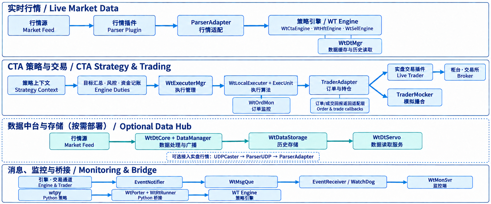
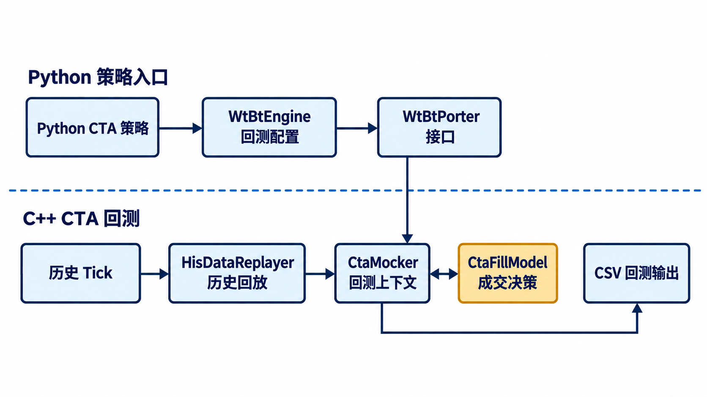

# WonderTrader：CTA 成交模型与模拟盘验证

这个仓库是在 [WonderTrader 原版](https://github.com/wondertrader/wondertrader) 上做的二次开发，不是 WT 官方仓库。

原版 WonderTrader（WT）是以 C++ 为核心的开源量化研发与交易框架，覆盖行情接入与存储、策略开发、历史回测、组合与执行管理、交易通道和运行监控。它提供 CTA、HFT、SEL、UFT 等策略引擎，并通过 [wtpy](https://github.com/wondertrader/wtpy) 向 Python 提供策略、数据和监控接口。

WT 原有的行情、策略引擎、执行器、交易通道和回测框架都来自原项目。本仓库目前主要做两件事：改造 **CTA 回测里目标仓位到模拟成交** 的规则并测试；运行 **纯 C++ 本地模拟盘**，核对业务链路、记录问题并逐步修复。模拟盘工作尚未完成，会持续更新。Python 侧的成交模型接口改动在 [wtpy-cta-fill-lab](https://github.com/newbigdeng/wtpy-cta-fill-lab)。

项目文档分为两个目录：[`docs/cta-fill`](docs/cta-fill/README.md) 介绍成交模型改造与测试，[`docs/sim`](docs/sim/README.md) 记录模拟盘链路、问题、处理过程和验证结果。

## 原版 WT 是怎么跑的

先看实盘/仿真盘。行情接口收到数据后，`ParserAdapter` 统一代码并交给引擎；引擎驱动策略、汇总目标仓位，再把目标交给执行器。执行单元决定报单节奏和价格，`TraderAdapter` 管交易通道的订单、持仓和资金状态。末端接真实交易接口就是实盘，接 `TraderMocker` 就是本地仿真撮合。两者共用上面的执行链。

图分成四条线。第二条以 CTA 为例；HFT、SEL 并不一定走相同的执行器路径。图里省略了订单/成交回报的反向箭头：回报先回到 `TraderAdapter`，再通知执行器；`TraderMocker` 自身负责本地模拟撮合，不是另一套独立服务。

数据中台是按需部署的另一条行情链：`WtDtCore` 接收、广播行情并通过 `WtDataStorage` 写历史数据，`WtDtServo` 提供数据读取；若用 UDP 广播接入实盘，可走 `UDPCaster → ParserUDP → ParserAdapter`。消息路线则从引擎和交易通道经 `EventNotifier`、`WtMsgQue` 到 wtpy 的事件接收与监控端。Python 策略通过 `WtPorter`/`WtRtRunner` 接入引擎。这些路径不是每个 Tick 都要依次经过的单条流水线。

这里的“组合管理”主要指引擎汇总多策略目标、路由到执行器；资金盈亏记账在引擎，交易账户资金状态在 `TraderAdapter`。原版已有过滤、仓位缩放和风险监控等机制，但不应把它们理解为独立的通用风控服务。[原版实盘架构图](images/prod_struture.png)也保留在仓库里。

CTA 回测走另一条链：`HisDataReplayer` 回放历史数据，`CtaMocker` 驱动策略、维护模拟仓位和盈亏，不经过上图的 `TraderAdapter`/`TraderMocker`。下面这张是原版 README 的回测架构图，更多背景可看 [WT 上游仓库](https://github.com/wondertrader/wondertrader)。

我改动的部分在 CTA 回测路径上。下图只画与这次改动有关的节点，省略了其他策略引擎和实盘执行链；`CtaFillModel` 给出成交决策，实际改仓位、记账和写 CSV 仍由 `CtaMocker` 完成。

## 我改了什么

### CTA 回测成交模型

原来的 CTA 回测在处理目标仓位时，基本按目标与当前仓位的差额直接成交。这种做法很适合作基线，但没法观察“只成交一部分”会怎样影响后面的策略信号。我想保持策略不变、单独替换成交规则，于是把成交判断从 `CtaMocker` 中拆了出来，并留下保持原行为的 `LegacyCtaFill` 作对照。

- `CausalTouchFill` 按事件顺序和对手盘报价判断能否成交。这个模型仍是全量成交；没有可用报价时不会编造一个成交价。
- `VolumeLimitedFill` 根据 Tick 成交量和参与率限制本次可成交手数，允许部分成交。一个 Tick 的量不能被同一事件里的多次尝试重复使用。
- 待成交信号保存最新**目标仓位**，剩余量每次用“目标 − 实际仓位”重算。目标被覆盖时，不会把旧目标的未成交量叠到新目标上。
- 增加成交决策、实际成交和目标覆盖的审计输出，并用单元测试、Legacy 输出对照和真实 Tick 回测检查数量、费用、反手与目标取消等边界。

核心代码在 [`CtaFillModel.h`](src/WtBtCore/CtaFillModel.h)、[`CtaMocker.cpp`](src/WtBtCore/CtaMocker.cpp) 和 [`test_cta_fill_model.cpp`](src/TestUnits/test_cta_fill_model.cpp)。目前这些改动只用于 CTA 回测；模型里的“成交”是回测记账，不是交易所委托回报。

模型规格、配置入口、测试结果及待解决边界见 [`docs/cta-fill`](docs/cta-fill/README.md)。

### 本地模拟盘验证（持续更新）

我还运行了原生 C++ 的本地模拟链路：人工 Tick 进入 `QuoteFactory`，经存储和 UDP 广播分别供给策略与 `TraderMocker`；CTA 目标通过执行器形成委托，再由模拟成交回报更新交易通道持仓。

- 已完成两轮基线、最新价取价对照、三手分笔成交、持仓恢复和错误合约代码对照。委托、成交、持仓落盘及恢复的业务闭环已经跑通。
- 已处理实验中的标准合约代码、累计行情续接和最小部署问题。核心程序可以运行，但原始 CMake 目标的可选插件打包问题仍待修复。
- 已复现订单累计成交量为负、订单/成交日期为 0、策略资金快照滞后、首次 Tick 未转发，以及程序无法正常退出的问题。当前完成了复现和定位，尚未提交这些问题的源码修复。

截至当前阶段，结论是“本地业务闭环通过，字段、快照和退出验收未全部通过”。后续修复、回归和新的实验结果会继续更新 [`docs/sim`](docs/sim/README.md) 及本节；当前没有接入 SimNow。

原版项目：[WonderTrader](https://github.com/wondertrader/wondertrader) · [wtpy](https://github.com/wondertrader/wtpy)。本仓库保留原项目的 [MIT 许可](LICENSE) 与 Git 历史。
