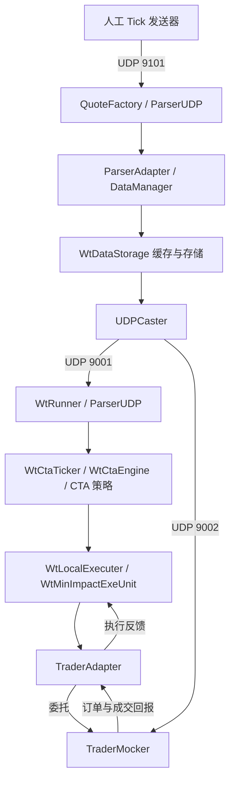

# 模拟盘主要链路与状态职责

## 两条行情消费支路

发送器只向行情中台入口发数据。本次没有直接向 9001/9002 发送而绕过中台。Runner 与 TraderMocker 各有独立行情 socket 和缓存，Runner 收到行情并不保证模拟撮合器已经拿到同一报价。

## 各层负责什么

| 模块 | 状态与职责 |
| --- | --- |
| QuoteFactory / ParserAdapter | 行情接入、合约识别，交给中台 |
| WtDataStorage | Tick 缓存、实时存储块、分钟线与输入校验 |
| UDPCaster | 异步广播给下游消费者 |
| WtCtaTicker / WtCtaEngine | 时间推进、策略分发、目标汇总 |
| CtaStraBaseCtx | 策略理论持仓、理论成交及组合资金记账 |
| WtLocalExecuter / WtMinImpactExeUnit | 比较目标、通道持仓和在途委托，决定报单 |
| TraderAdapter | 接收交易回报，维护通道订单、持仓与账户状态 |
| TraderMocker | 独立报价缓存、在途订单、本地撮合与模拟通道持仓 |

策略理论成交价不会被后来的通道实际成交价自动替换。因此理论持仓/资金与交易通道持仓/流水需要分别核对。

相关源码：[`WtCtaTicker.cpp`](../../src/WtCore/WtCtaTicker.cpp)、[`CtaStraBaseCtx.cpp`](../../src/WtCore/CtaStraBaseCtx.cpp)、[`TraderAdapter.cpp`](../../src/WtCore/TraderAdapter.cpp)、[`TraderMocker.cpp`](../../src/TraderMocker/TraderMocker.cpp)、[`WtDataWriter.cpp`](../../src/WtDataStorage/WtDataWriter.cpp)。

## 线程与可重复性

策略和执行器线程池设为 0，仍存在 UDP I/O、异步 writer、广播、CTA 时钟和模拟撮合线程。本次观察 Runner 为 6 个线程，中台输入前为 7、输入后为 9，不能把线程池关闭理解为整个进程单线程。

人工输入的价格路径可以重复，订单遇到的报价仍受异步调度影响。固定拆量为 1 手消除了该部分数量随机性，没有建立下单完成后再推进下一 Tick 的事件屏障。

当前只验证低速输入。异步队列与 UDP 广播的高负载积压、丢包和背压边界尚未测量。

## 合约代码与输入连续性

实验原始 Tick 使用交易所 `SHFE`、合约 `rb2301`；订阅原始完整名为 `SHFE.rb2301`，CTA 标准代码与执行路由为 `SHFE.rb.2301`。这些字符串属于不同接口层。

恢复后既要加载持仓，也要续接同交易日的累计行情量。缓存已有 300 时从 10 重新发送，会触发累计量回退校验；这与持仓是否加载成功是两项独立检查。
